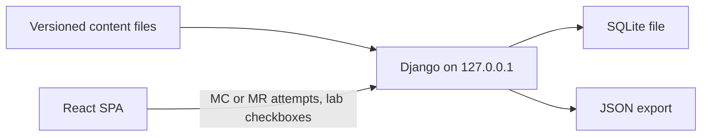
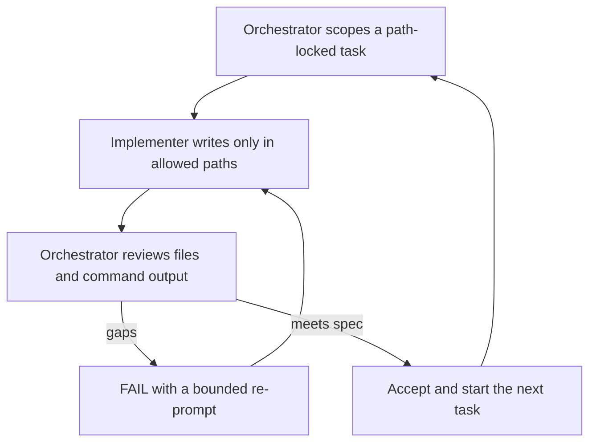

# AWS Solutions Architect + Terraform Lab Workbook

**Planning only. Do not start Phase 0, create `docs/`, or write application code until you explicitly approve this workbook plan in a later message.** Editing this file under the KISS rewrite is not that approval. The repo at [C:\Users\dbadmin\Desktop\GitServ\ccna\web_app](C:\Users\dbadmin\Desktop\GitServ\ccna\web_app) stays empty of application code until then.

**KISS rule:** if a feature does not teach an exam bullet, protect the learner from a surprise AWS bill, or score/store progress, do not build it.

Cursor usage is separate from AWS lab charges. You have accepted that hands-on labs may cost more than $10.

## 1. Locked decisions

Locked 2026-09-23, plus the KISS rewrite on 2026-09-23. Do not reopen without an explicit change.

- Windows 11. Lab commands are PowerShell first. Show bash only where syntax differs.
- Personal local app: React + Django on `127.0.0.1` + SQLite file on this PC. No hosting, no login, no cloud database, no LLM API, no browser terminal, no AWS calls from the app.
- Visual layout is not specified in this file. Chrome, tabs, sidebar, cards, headers, and buttons are defined only in the layout plan: [`.cursor/plans/ccna_layout_replica_160c046c.plan.md`](.cursor/plans/ccna_layout_replica_160c046c.plan.md) (replica of [https://claude.ai/artifact/5HW39UKEGNCihyWgE1zNeA](https://claude.ai/artifact/5HW39UKEGNCihyWgE1zNeA)). Four tabs only: Labs, Exam drills, Coverage, Start here. **Phase 1 implements that layout plan.** Phase 0 does not. Later phases fill those four tabs with content; they do not invent a different shell.
- You run AWS CLI and Terraform in your own terminal. The app never receives credentials or account IDs.
- You are the only person who may create, change, or delete anything in AWS. Agents never touch AWS (section 9).
- Coverage baseline: [cursor_saa_c03_exam_objectives_coverage.md](c:\Users\dbadmin\Downloads\cursor_saa_c03_exam_objectives_coverage.md) and [solutions-architect-associate-03.pdf](c:\Users\dbadmin\Downloads\solutions-architect-associate-03.pdf). 189 local tracking IDs, not AWS-issued. Report coverage of the supplied guide, never “all possible exam questions.”
- All 189 IDs start `missing`. No contract checkbox is satisfied until Phase 6 evidence.
- Drill bank: at least 210 AWS and 111 Terraform items (321+), at least 20 per module. Formats are multiple choice and multiple response only.
- 21 guided + 21 unguided lab pairs. NAT, ALB, EC2, RDS, EKS, ElastiCache, GuardDuty, Macie, and customer-managed KMS stay in labs you run. $10 is a warning, not a stop.
- Direct Connect, Outposts, Snow, Wavelength, VMware Cloud on AWS, Shield Advanced, and CloudHSM stay in lessons and design exercises. Not created.
- HCP Terraform: no-charge hands-on only. Otherwise docs, drills, and a design exercise. Never connect AWS credentials to HCP on a paid path.
- Learning path: AWS modules and labs first, then Terraform. Terraform reuses the A0/A1 IAM/S3 baseline.
- Orchestrator / implementer loop with path locks. No required model name or slug.
- AWS answers are validated with the AWS Knowledge MCP Server. Terraform answers are validated with the Terraform MCP Server registry/docs tools. MCP is not part of the web app.
- Specs in `docs/` (five files) before application code, and only after this plan is later approved.

**Do not build / do not do:** public hosting; AWS calls from the app; AWS calls from agents; AWS API MCP or any provisioning MCP; LLM API; browser terminal; accounts; Django REST framework unless a later ADR; matching, ordering, or drag-and-drop; a pass probability; live `terraform apply` / credentialed `plan` / `destroy` by agents; HCP workspace operations by agents; a required model slug.

## 2. Certification pointers

Access date: 2026-09-23. Full transcription belongs in `docs/coverage-and-metrics.md` after Phase 0 starts. Do not treat this section as a second exam guide.

**SAA-C03.** Supplied PDF *AWS Certified Solutions Architect - Associate: Exam Guide (SAA-C03)*, copyright 2026 Amazon Web Services. 30 physical pages; printed pages 1–26 map to physical pages 5–30 (add 4). Product page: [AWS Certified Solutions Architect – Associate](https://aws.amazon.com/certification/certified-solutions-architect-associate/). 130 minutes, 65 questions (50 scored + 15 unidentified unscored), $150, passing scaled score 720, compensatory. Formats: multiple choice (one of four) and multiple response (two or more of five or more). Never equate 720 with 72 percent. Never convert practice accuracy into a scaled score.

Atomic counts summing to 189: 107 knowledge and 82 skill bullets across 14 tasks. Domain totals: 32, 43, 50, 64. Domain 4 has the most bullets and the lowest weight (20%). Bullet count is for coverage; domain weight is for the mock exam and weighted rollup. Never mix the two.

**Discrepancy log (2026-09-23).** Online edition lists four services the supplied PDF does not: AWS AppSync (twice), Amazon Kendra, AWS Audit Manager. PDF is authoritative. Record those four as `edition_variance`, teach at awareness level, exclude from the service denominator. Preserve PDF wording for `SAA-2.2-K02` (AMS / Comprehend / Polly): do not teach Comprehend or Polly as AMS components; add a flagged current-docs note. Keep guide names such as Amazon Quick and Amazon SageMaker AI, plus a cited current-status note when branding differs.

**Terraform Associate (004).** [Infrastructure Automation certifications](https://developer.hashicorp.com/certifications/infrastructure-automation) and [004 exam content list](https://developer.hashicorp.com/terraform/tutorials/certification-004/associate-review-004). Terraform 1.12, 1 hour, $70.50 plus tax, no free retake, 2-year credential. Objectives 1a–1c through 8a–8d (37 lettered). Weights, item count, and passing score stay `unpublished`. Cover both wordings of 4f and 4h; the objectives table is the binding outline.

**Toolchain, freeze at lab-file time, not in this plan.** AWS CLI v2. Terraform `>= 1.12` and `< 1.17`, stable only. Pin `hashicorp/aws` 6.x after a fresh registry check. App: Node.js 24 Active LTS and Django 6.1.1 with the latest Python 3.13 micro on scaffold day.

## 3. Scope and success

In scope: local web app; five markdown specs in `docs/`; original lessons for 189 SAA bullets and 37 Terraform objectives; 321+ original MC/MR items; 50-question mock exam; design exercises for skill bullets with no live lab; 21 guided labs (≥15 execution steps) and 21 unguided labs (≥15 acceptance criteria); 189-row coverage registry; SQLite progress; separate AWS and Terraform readiness scores; cost and cleanup tracking; tests; setup guide.

Out of scope unless later approved: multi-user accounts, hosted deploy, agents or the app provisioning AWS, leaked exam items, a numeric chance of passing.

Success on a clean install:

- `npm ci`, `npm run dev`, and `npm run build` succeed on Node 24.
- Learner opens the dashboard, reads a lesson, answers one MC item and one MR item, reviews rationales, checks guided-lab steps, opens an unguided challenge without the solution, records cleanup, reloads, export then import.
- Content lint fails if a guided lab has fewer than 15 execution steps, an unguided lab has fewer than 15 criteria, a module has fewer than 20 questions, a question lacks a rationale and an official citation, or a lab lacks teardown plus post-teardown checks.
- Registry contains all 189 SAA IDs exactly once. Lint fails on duplicate, missing, or invented IDs.
- Every knowledge bullet has substantive lesson content and at least one mapped assessment. Every skill bullet also has an applied exercise labeled `live_aws`, `local_validation`, or `design_exercise`.
- Coverage is planned versus verified, separate from learner mastery. A lesson without evidence is a gap.
- UI never shows a pass probability. Too little evidence shows “insufficient evidence.”
- No secrets, account IDs, or root-user workflows in source, fixtures, or screenshots.

Exam fees ($150 and $70.50) are separate from AWS lab charges.

## 4. Curriculum map

Nine modules. Unlock: A0 → A1 → A2 → A3 → A4, then T1 → T2 → T3 → T4. One AWS module per guide domain, one lesson group per task. Tags: `exam`, `hands-on`, `advanced`. Reading a lesson is not mastery.

- **A0** Lab safety and account baseline. Shared responsibility, root vs IAM, MFA, regions, quotas, tags, budget alerts vs hard stops, Terraform state sensitivity. Credits bullets to real task IDs (`SAA-1.1-K05`, `SAA-1.1-S01`, Domain 4 cost tools).
- **A1** Domain 1, 32 bullets. L1.1–L1.3 secure access, workloads, data controls.
- **A2** Domain 2, 43 bullets. L2.1–L2.2 scalable / loosely coupled, HA / fault tolerant.
- **A3** Domain 3, 50 bullets. L3.1–L3.5 storage, compute, database, network, ingestion.
- **A4** Domain 4, 64 bullets. L4.1–L4.4 cost-optimized storage, compute, database, network.
- **T1** Objectives 1a–1c, 2a–2d, 3a–3g.
- **T2** Objectives 4a–4h, including both 4f/4h wordings.
- **T3** Objectives 5a–5d, 6a–6d, 7a–7c.
- **T4** Objectives 8a–8d. Hands-on only on a no-charge HCP path.

Lesson files carry `objectiveIds`, `drillIds`, `labIds`, `exerciseIds`, `tier`, `citationIds`. A heading or service mention is not coverage. Purchasing bullets are analysis only: never buy a Savings Plan, Reserved Instance, subscription, or hardware. Multi-account and hybrid lessons state the live-practice limit.

## 5. Lab catalog

21 guided + 21 unguided pairs (above the floor of 20). Each unguided pair changes the requirements, does not repeat guided steps, and hides the reference solution until the gate. You create expensive resources on purpose, then delete them. Agents write the files; you run the commands.

Rates read 2026-09-23 for `us-east-1` examples, not a bill quote. Re-read official pricing for the learner’s region before a lab is marked verified. Default region `us-east-1`.

Sourced: NAT Gateway $0.045/hour and $0.045/GB ([VPC pricing](https://aws.amazon.com/vpc/pricing/)); public IPv4 $0.005/hour (same); gateway VPC endpoints no hourly/data charge in that example; customer-managed KMS $1/month prorated, scheduled-for-deletion not charged ([KMS pricing](https://aws.amazon.com/kms/pricing/)); ALB $0.0225/hour plus LCU, partial hour bills as full hour ([ELB pricing](https://aws.amazon.com/elasticloadbalancing/pricing/)); t3.micro Linux $0.0104/hour ([T3](https://aws.amazon.com/ec2/instance-types/t3/)); EKS standard support $0.10/cluster-hour, extended $0.60 out of lab ([EKS pricing](https://aws.amazon.com/eks/pricing/)); alert-only Budgets no charge.

Fill before publish: RDS, EBS, EFS, ElastiCache, Fargate, Step Functions, Athena, Route 53 private zone, WAF, Secrets Manager, GuardDuty, Macie.

Commands: PowerShell first; `$env:AWS_PROFILE`, `$env:AWS_REGION`. Destructive commands print account, region, and resource id, then require you to type the account id.

- **GL-01 / UL-01 Identity, budget, and preflight.** ~90 min. IAM lab user with MFA, no root access keys, alert-only budget (actual $2/$5/$8, forecast $5/$8), tags. Permission boundary denies CloudHSM, Shield Advanced, Direct Connect, Outposts only. Unguided: daily role vs break-glass. Includes the tagged kill-switch snippet **you** run if teardown fails. Same-hour charge $0 for the alert-only budget.
- **GL-02 / UL-02 Private S3 data controls.** ~90 min. BPA, versioning, one-day lifecycle, tiny object, bucket policy. Unguided: second prefix plus Macie on that bucket only after price is in the lab, then disable.
- **GL-03 / UL-03 IAM role, resource policy, and STS.** ~75 min. Role can read only the lab bucket, assume with STS. Unguided: scoped policy, then GuardDuty on/off after price is in the lab.
- **GL-04 / UL-04 Customer-managed KMS key.** ~75 min. Symmetric key, encrypt one object, schedule deletion, do not cancel. Unguided: key policy for the lab role; Secrets Manager and SSM standard parameter after price is written, then delete both.
- **GL-05 / UL-05 VPC segmentation.** ~90 min. VPC, two subnets, routes, SG, NACL, S3 gateway endpoint. No NAT. Unguided: second AZ subnet and tighter NACL. $0 only if no public IPv4 and no NAT.
- **GL-06 / UL-06 NAT gateway, then delete it.** ~75 min. One NAT, private route, small connectivity check, delete NAT, release EIP. Unguided: compare with GL-05 gateway endpoint. Same-hour example $0.045 plus data and $0.005 per public IPv4 hour.
- **GL-07 / UL-07 EC2, EBS, and EFS.** ~120 min. One t3.micro, small gp3, snapshot, terminate and delete. Unguided: small EFS, mount, unmount, delete. Stopped instances still bill; teardown terminates and deletes.
- **GL-08 / UL-08 Application Load Balancer.** ~90 min. Internet-facing ALB, one healthy t3.micro, HTTP check, delete ALB, TG, instance. Unguided: WAF web ACL after price is in the lab, delete ACL before ALB.
- **GL-09 / UL-09 Auto Scaling.** ~75 min. Launch template, ASG desired 1, then 0, delete group. Unguided: target tracking, scale to 2 then 0, prove no instances.
- **GL-10 / UL-10 Queue and event path.** ~90 min. SQS, SNS, Lambda no VPC. Delete function and `/aws/lambda/<name>` log group. Unguided: DLQ and idempotency key.
- **GL-11 / UL-11 API Gateway and Lambda.** ~75 min. One HTTP API route, one Lambda, one test call, delete both. Unguided: authorized second route and unauthorized 403.
- **GL-12 / UL-12 Step Functions.** ~75 min. Small standard state machine, one success, delete. Unguided: failure branch and retry. Transition price before publish.
- **GL-13 / UL-13 DynamoDB.** ~75 min. On-demand table, handful of items. Unguided: one GSI, query, remove. No reserved or provisioned.
- **GL-14 / UL-14 RDS, single AZ.** ~120 min. Smallest single-AZ PostgreSQL, no Multi-AZ, short backup, delete with no final snapshot. Unguided: restore copy, delete that too. Main forgotten-resource cost risk.
- **GL-15 / UL-15 CloudWatch and CloudTrail.** ~75 min. Alarm on an existing AWS metric, trail to lab bucket, delete both. Unguided: one-day retention on GL-10 log group. No paid custom metrics.
- **GL-16 / UL-16 Private DNS.** ~60 min. One Route 53 private hosted zone, one private record, delete. No public zone, no domain purchase. Unguided: second record then delete.
- **GL-17 / UL-17 Athena on a tiny file.** ~60 min. Small CSV, one table, one query, drop table. No leftover crawler. Unguided: convert result, delete outputs.
- **GL-18 / UL-18 ECS on Fargate.** ~90 min. Cluster, task definition, short task, desired 0, delete. Unguided: change priced CPU/memory, run once, delete.
- **GL-19 / UL-19 EKS control plane, then delete it.** ~120 min. Cluster on standard support, no node group, no workload, then delete leftover SG, log group, ENI. Unguided: Fargate profile or one managed node, remove before cluster delete. Standard support $0.10/hour (~$2.40/day if forgotten). Extended support out of lab.
- **GL-20 / UL-20 Terraform workflow, modules, state, and import.** ~150 min. Local backend: `init`, `fmt`, `validate`, `plan`, `apply`, `state list`, out-of-band change, refresh, `destroy`. State gitignored. **You** run apply/destroy. Unguided: local module, import, saved plan not applied.
- **GL-21 / UL-21 ElastiCache, then HCP as allowed.** ~120 min. Guided: smallest ElastiCache node, describe, delete cluster and subnet group. Unguided: Terraform 8a–8d. No-charge HCP workspace only, stop before AWS credentials. If paid, no HCP account; use docs, drills, and `design_exercise`.

Same-hour illustration only: NAT ~$0.045 plus data, ALB $0.0225 plus LCUs, t3.micro $0.0104 plus $0.005 public IPv4, EKS $0.10. Forgotten hourly resources overnight can exceed $10. Do not create: Direct Connect, Outposts, Snow Family, Wavelength, VMware Cloud on AWS, Shield Advanced, CloudHSM, or an AWS Organization. SCPs are taught with the GL-01 permission boundary.

### Design exercises

All 82 skill bullets need an applied exercise with observable criteria. Labs cover disposable services. The rest are `DE-*` design exercises: scenario, constraints, decision/diagram/policy/sizing/cost/troubleshooting, rubric. Never labeled as AWS experience. Required at least for: Direct Connect vs VPN vs internet; Outposts/hybrid; Snow Family; multi-account Control Tower/SCPs; directory federation; multi-Region DR vs RPO/RTO; CloudHSM vs KMS; Kinesis/MSK; EMR/Glue; data lake/Lake Formation; visualization; Spot/RI/Savings Plans comparisons; Transit Gateway/peering; Global Accelerator/CDN; throttling; storage migration; cross-engine database migration.

Every content item has `practice_mode` of `live_aws`, `local_validation`, `design_exercise`, or `concept_review`, plus `constraint_reason` when live execution was rejected. Lint fails if a skill bullet has no lab step and no design exercise, or if an exercise has no observable rubric.

Each lab spec includes id, time, difficulty, same-hour and 24-hour estimates, objectives, services, prerequisites, diagram, least-privilege actions, region, preflight, ≥15 steps or criteria, checks, troubleshooting, security and cost questions, and a teardown block (section 9).

## 6. Assessment

Floors, lint-enforced: AWS ≥210 (at least one per atomic bullet plus ≥21 scenario items; ≥36 / 48 / 56 / 70 by domain); Terraform ≥111 (≥3 per lettered objective); ≥20 per module. An item may map to several bullets only when it truly tests each. Lint flags more than three bullets for orchestrator review. Fake mappings to shrink the bank are rejected.

**Formats:** multiple choice (one of four) and multiple response (prompt states how many). Those are the only item types in the app. Matching, ordering, and drag-and-drop are not built. Difficulty mix inside a module: about 30% foundation, 50% applied, 20% tradeoff (guideline, not lint).

**Mock exam:** 50 exam-style items, 15/13/12/10 by domain to mirror weights. State that this is a curriculum design choice. Raw score out of 50 and by domain. Never a 100–1000 scaled score, never compared to 720.

Scoring is all-or-nothing in practice and exam modes. Rationale after submit. First attempt is the first exam-mode submit for a question id. Later submits are retries. Reveal or hint before submit marks `assisted` and drops first-attempt accuracy. Shuffle choice order per attempt; store presented order; stem and correct choice ids stay stable. If a question changes, give it a new id. Retry allowed; show first-attempt vs best-later; completion cannot exceed 100%.

Quality: one official source, at least one atomic objective id, no “always/never” unless the source uses it, no trivia absent from the objective, `reviewedOn` after orchestrator review. Orchestrator spot-checks at least 10%, including every >3-bullet mapping.

**Answer validation (authors and reviewers, not the running app):**

- AWS items: [AWS Knowledge MCP Server](https://awslabs.github.io/mcp/servers/aws-knowledge-mcp-server) at `https://knowledge-mcp.global.api.aws` (`search_documentation` / `read_documentation`; regional availability when a lab claims `us-east-1`). Store the official URL and accessed date.
- Terraform items: [Terraform MCP Server](https://developer.hashicorp.com/terraform/mcp-server) **registry/docs tools only**. No HCP workspace create/update/delete/run. Store the registry or HashiCorp URL and accessed date.
- PDF defines which bullets exist. MCP checks whether the answer is currently true. If they disagree, keep PDF wording, flag a note, log the discrepancy.
- Phase 3, 4, and 6 content tasks do not start if these two servers are missing. Do not guess from training data. Do not add MCP to the web app.

## 7. Architecture

Local React UI. Django on `127.0.0.1` scores attempts and stores progress in `backend/db.sqlite3` (gitignored). Settings copy (on the Start here tab per the layout plan) states that another local process could call that port, and that answer keys exist in content files and SQLite.

**UI chrome:** do not invent routes or nav. When **Phase 1** begins, implement the replica in [`.cursor/plans/ccna_layout_replica_160c046c.plan.md`](.cursor/plans/ccna_layout_replica_160c046c.plan.md). Functional surfaces (labs, MC/MR, coverage registry, cost/teardown, export/import, readiness) still exist; they render inside those four tabs. Do not implement that chrome in Phase 0.

- UI: TypeScript, Node 24, React, React Router, Vite, plain CSS, npm, lockfile committed.
- API: Django 6.1.1 JSON views. No third-party REST framework without a new ADR. Python 3.13 latest micro on scaffold day. `backend/requirements.txt` pinned.
- Content in git; learner records in SQLite. React bundle does not embed answer keys.
- Tests: Django test runner for scoring; Playwright for the slice; content lint; `terraform fmt -check` and `terraform validate` without credentials.

Repository layout: `docs/` (five specs); `content/objectives|lessons|questions|labs|exercises|citations|coverage`; `frontend/src`; `backend/`; `lab-fixtures/` with gitignored state; `tests/unit`; `tests/e2e`.

Accessibility: visible focus, skip link, labeled controls, WCAG 2.2 AA, keyboard path, no information by color alone, 375px and 1280px, copy button plus `<pre>`.

Threat model: Markdown without raw HTML; size-capped schema-checked imports; `rel="noopener noreferrer"`; no CLI output uploaded; CSRF on; lockfiles committed; state and `db.sqlite3` never in git. Public hosting needs a new ADR.

## 8. Data model, coverage, and readiness

Stable ids: `SAA-1.1-K01`, `tf.004.4f`, `lesson.m6.workflow`, `q.m6.014`, `lab.gl07`, `lab.ul07`.

Records: Objective (atomic SAA ids with verbatim `source_text`); coverage registry row (`lesson_refs`, `drill_refs`, `guided_refs`, `unguided_refs`, `exercise_refs`, `practice_mode`, `constraint_reason`, `validation_refs`, `status` missing/planned/partial/implemented_unverified/verified, `gap`, `owner`, `next_action`); service awareness row; Lesson; Question (MC or MR only); Lab; Design exercise; Citation; Attempt (`question id`, mode, presented order, selected ids, correct, assisted, submitted time — no confidence slider, no content hash, no idle timer); Lab evidence (`not-started|self-reported|unresolved`, never shown as “verified in AWS”); Cost entry; Settings/import metadata `schemaVersion: 1`.

Export `workbook-progress.json`. Import validates, rejects unknown future versions, replace or abort. Corrupt file does not change the database. Reset requires typing `RESET`. The SQLite file on disk is the other copy; settings explain both. JSON export/import is the product backup path.

**Learner metrics** (half-up whole percents except readiness deltas as integer points): lesson completion = read / in scope (exposure, not mastery); drill completion = distinct attempted ids / in scope; accuracy = correct first-attempt exam-mode / first-attempt exam-mode (“no attempts” if denominator 0); lab completion = all checkpoints self-reported; cleanup recorded separately.

**Curriculum coverage** (workbook, not learner): verified atomic = verified / 189 × 100; domain coverage against 32/43/50/64; weighted guide coverage = 0.30 D1 + 0.26 D2 + 0.24 D3 + 0.20 D4; task/K/S counts separate; live vs design-exercise separate; planned vs verified separate; service awareness its own denominator (Redshift deduped, `edition_variance` excluded). Zero verified coverage means the workbook is unverified, not that the learner knows nothing. Mastery shows “not assessed” until attempts exist. None of these is a pass probability or scaled score.

**Readiness** (keep this formula). Not a pass probability.

- AWS withheld until ≥40 first-attempt exam-mode items and ≥5 in each of 4 domains; else “insufficient evidence” plus missing counts.
- Terraform withheld until ≥30 first-attempt exam-mode items and ≥2 in each of 8 groups.
- `readiness = round(100 * (0.70 * weightedFirstAttemptAccuracy + 0.20 * objectiveCoverage + 0.10 * recentAccuracy))`. Recent accuracy is last 14 days if those 14 days have ≥10 items; else the 0.10 moves onto first-attempt accuracy. AWS uses 30/26/24/20, renormalized across domains with attempts. Terraform uses equal group weights and says HashiCorp publishes none.
- Objective coverage in the formula is the fraction of atomic AWS bullets (or Terraform lettered objectives) with at least one first-attempt item. Not lessons read. Not curriculum coverage.
- Assisted attempts excluded. No partial-credit path exists.
- Integer display. Caption: weighted summary of this workbook’s practice, not a prediction, does not include exam-day form difficulty.
- Confidence `low` just above threshold; `medium` at ≥80 AWS or ≥60 Terraform items with every domain represented. Never “likely to pass.”
- Trend vs score stored 7 days earlier, in percentage points. If either side was insufficient evidence, say that instead of a delta.

## 9. Budget, security, teardown, and agent AWS isolation

$10 is a warning, not a stop or a promised total. Logged deviation from the coverage contract’s $10 retain rule, confirmed 2026-09-23.

**Agents never touch AWS.** You are the only actor who may create, change, start, stop, tag, or delete anything in AWS (including IAM, budgets, S3, networking, compute, databases, EKS, billing). Orchestrator, implementer, and any other subagent must not call AWS APIs, AWS CLI, or Console; must not run `terraform apply`, `terraform destroy`, or a credentialed `terraform plan`; must not create or change HCP workspaces, variables, or runs; must not use the AWS API MCP Server or any provisioning MCP; must not inventory, tag, or clean up your account.

Allowed without talking to AWS: write lab files and fixtures; `terraform fmt` and `terraform validate` without credentials; AWS Knowledge MCP (docs); Terraform MCP registry/docs only. Live lab commands stay labeled **unexecuted** until you report that you ran them.

Budget alerts lag ~8–12 hours and do not stop spend ([AWS Budgets](https://docs.aws.amazon.com/cost-management/latest/userguide/budgets-managing-costs.html)). One alert-only budget, no budget actions ([Budgets pricing](https://aws.amazon.com/aws-cost-management/aws-budgets/pricing/)).

Controls you run: preflight `aws sts get-caller-identity`, region, CLI v2, Terraform version, same-hour and 24-hour estimates; cost page is a manual ledger, not live billing; type `I ACCEPT THE COST RISK` before create/apply on GL-06, GL-07, GL-08, GL-09, GL-14, GL-18, GL-19, GL-21; tags `Workbook=aws-tf-lab`, `LabId`, `CreatedAt`, `ExpiresAt` same calendar day; you check inventory boxes yourself.

Kill switch is a **GL-01 PowerShell snippet you run**, not a product feature and not something an agent executes. It lists tagged resources in `$env:AWS_REGION`, deletes only those ids after you type the STS account id, refuses root profile / empty region / zero or unexpectedly large matches, and does not delete untagged resources.

**Teardown** on every guided and unguided lab. You run it when finished and when you stop early. Stopping an instance is not teardown. Stop charges panel is visible from the first create step, and on unguided labs before any hint. Complete requires every verification box checked (self-reported). Each teardown block: lab id and region scope; ordered PowerShell deletes (dependents first); delete not stop; KMS scheduled deletion not canceled; verification expecting empty/`ResourceNotFound`; still-billing note (time already used, transfer, tax, lag); recovery then the tagged kill switch for that lab id. Lint rejects teardown without delete commands, verification, or still-billing note.

Free Tier is never assumed. Named CLI profile or Identity Center session. No keys in git or the app. No root keys. State gitignored. Least privilege per lab; GL-01 boundary blocks CloudHSM, Shield Advanced, Direct Connect, Outposts.

## 10. Orchestrator and implementer loop

Any available model may fill a role. This plan does not name one.

**Orchestrator** (read-only except `docs/status.md`): scopes a path-locked task (spec id, allowed paths, done criteria, dependencies); does not author lessons, questions, labs, or application code; reviews files, command output, and MCP citations, not summaries; accepts or FAIL with a bounded re-prompt; signs Phase 6 only after running the cited checks.

**Implementer:** one writer, one path set, one task; builds the spec as written; if the spec is wrong, updates the markdown spec first and stops for review; returns files changed, commands, exit codes, issues, and MCP evidence for content; never touches AWS.

`docs/status.md` ledger: task id, role, spec id, allowed paths, dependency, status, evidence. Do not staff a roster of named specialist agents. The coverage contract’s historical Grok/Composer line is not binding; this loop is.

Phase order: specs → slice (layout plan chrome plus cost/teardown in-card) → AWS then Terraform lessons → drills/exercises/registry → labs 5-AWS then 5-TF → review.

## 11. Phases

An MVP slice is not the finished workbook. **None of these phases start until you later approve this plan.**

- **Phase 0, specs.** Create `docs/` and the five files below, plus the 189-row registry skeleton (every status `missing`), 14-task rollup, service awareness map, discrepancy log, gap report, proposed mappings, budget decisions. `docs/architecture.md` must include a REQ that Phase 1 implements the layout plan. Done when every requirement in sections 3–9 has a REQ id, the registry has exactly 189 rows, and no application code exists yet. Phase 0 does **not** build UI chrome.
- **Phase 1, vertical slice including the layout plan.** This is the phase that **implements** [`.cursor/plans/ccna_layout_replica_160c046c.plan.md`](.cursor/plans/ccna_layout_replica_160c046c.plan.md): four tabs (Labs, Exam drills, Coverage, Start here), header stats, sidebar, lab-card chrome, in-card cost-risk and Stop charges. Also: Django on 127.0.0.1, one A0 lesson on Start here, one MC and one MR on Exam drills, GL-01 on Labs, insufficient-evidence copy, export/import on Start here, clean Node and Python install. Done when section 3’s end-to-end path works **inside that replica shell**. Do not ship a different nav.
- **Phase 3, curriculum.** 3-AWS (A0–A4) then 3-TF (T1–T4). Each claim checked via the matching MCP. Done when every SAA bullet and every Terraform lettered objective has a substantive lesson or a documented gap row.
- **Phase 4, drills, exercises, registry.** ≥210 AWS MC/MR items, 50-question mock exam, ≥111 Terraform items, design-exercise catalog, coverage dashboard, registry to `implemented_unverified`. Every item has an MCP-backed citation. Done when every SAA bullet has a mapped assessment, every skill bullet has a lab step or design exercise, every Terraform objective has ≥3 items, and coverage formulas have unit tests.
- **Phase 5, labs** (one phase, two ordered packets — not three headings).
  1. Packet **5-AWS:** GL/UL-01 through GL/UL-19 and the ElastiCache guided half of GL-21, plus fixtures. Done when step-count lint passes and unread prices from section 5 are filled from official pages.
  2. Packet **5-TF:** GL/UL-20 and the HCP half of UL-21 under the no-charge-only rule. Done when `terraform fmt -check` and `terraform validate` pass **without credentials**.
  Phase 5 is done when both packets are done: 21+21 labs, ≥15 steps, ≥15 criteria. Live apply remains unexecuted. Agents still create nothing in AWS.
- **Phase 6, review and sign-off.** Security, cost refresh, citation audit, MCP sample re-check, accessibility on the slice, edition recheck, registry to `verified` only with evidence, orchestrator’s own run of the local flow. Unresolved gaps mean less than full verified coverage.

No phase overwrites another owner’s open files.

## Spec-driven development

After later approval, Phase 0 writes these five files. Application code starts only after the spec it implements exists.

- [`docs/product-requirements.md`](docs/product-requirements.md) — scope, REQ ids, out of scope, agent-never-touches-AWS
- [`docs/architecture.md`](docs/architecture.md) — UI, Django API, SQLite, scoring, import/export, and a REQ that Phase 1 implements the layout plan
- [`docs/coverage-and-metrics.md`](docs/coverage-and-metrics.md) — 189-row registry, design-exercise rules, readiness and coverage formulas, MCP validation, discrepancy log
- [`docs/labs-and-safety.md`](docs/labs-and-safety.md) — 21 pairs, 15-step floor, teardown, budget, credentials
- [`docs/status.md`](docs/status.md) — task ledger

Every behavior traces to a REQ id. Implementers follow the spec; wrong spec → update markdown first, then stop for review. Specs stay Markdown. Phase 6 checks that these files exist and that required behavior is not code-only.

## 12. Tests

Keep: Django unit tests for scoring, readiness thresholds, percentage-point deltas, import rejection, reset, duplicate-attempt protection, assisted exclusion; coverage-calculation fixtures (zero, partial, fully verified domain, ticked-complete with no evidence); registry lint (189 IDs, lesson+assessment for K, lab or design exercise with rubric for S, verified rows have dated reviewer evidence); content lint (schema, unique ids, 20/module, 210/111 floors, 15 steps/criteria, ≥20+20 labs, citations, exam-style formats only, no account-id or `AKIA` patterns, no `delete-bucket` without a named bucket variable); copy-lint (no scaled score, no 720=72%, no design exercise as AWS experience, no “chance of passing”); Terraform `fmt -check` / `validate` without apply; Playwright for dashboard, lesson, MC, MR, reveal, retry, guided checkbox, unguided hint then gated solution, cost entry, reload, export/import, bad import, reset; viewports 375 and 1280.

Drop as separate gates: axe-core runner, idle-timer tests, matching/DND tests, partial-credit tests. Keyboard checks stay in the Playwright slice. Phase 6 MCP re-check is a review step, not a CI job that calls AWS. Commands not run in your account stay labeled unexecuted.

## 13. Risks

- Stale objectives. Mitigation: last-verified dates, 90-day stale badge, PDF baseline, version diff + your approval for a newer guide.
- Coverage theater. Mitigation: orchestrator rejects non-substantive mappings; human review of >3-bullet items.
- Design exercise mistaken for hands-on. Mitigation: `practice_mode` labels, separate live vs design numbers, copy-lint.
- Guide edition drift. Mitigation: discrepancy log, `edition_variance`, Phase 6 recheck.
- Terraform 4f/4h wording. Mitigation: lessons cover both passages.
- Forgotten hourly resource. Mitigation: estimates, cost-risk confirmation, tags, teardown, kill-switch snippet **you** run.
- Bill higher than same-hour examples. Mitigation: say so; alerts are not a cap.
- Readiness mistaken for a pass chance. Mitigation: copy-lint for “probability of passing” / “chance of passing.”
- Answer keys treated as secure. Mitigation: settings copy that keys are in content files and SQLite.
- Django bound publicly. Mitigation: bind `127.0.0.1`; reject non-local origin.
- Secondary Terraform pass-score trivia. Mitigation: those fields stay `unpublished`.
- Overlapping agent edits. Mitigation: path locks and `docs/status.md`.
- Agents changing AWS. Mitigation: section 9 hard rule; no AWS API MCP; no credentialed Terraform.
- Content guessed without MCP. Mitigation: Phase 3/4/6 stop if AWS Knowledge MCP or Terraform MCP registry tools are missing.

## 14. Acceptance checklist

Orchestrator signs only after running the tools. Implementer reports are not enough.

- Exam names, codes, domains, and Terraform lettered objectives match section 2. App reports coverage of the supplied guide.
- All 189 IDs appear exactly once. Knowledge bullets have lesson + assessment. Skill bullets have lab or labeled design exercise with dated evidence when claimed `verified`.
- Bank floors met with MC/MR only. Mock exam 15/13/12/10, no scaled score.
- Live vs design coverage separate. Design-only and unexecuted Terraform labeled accurately.
- 21+21 labs, 15 steps/criteria, teardown commands, Stop charges without opening a gated solution, cost-risk confirmation on hourly labs. $10 is not a ceiling.
- You run labs. Agents create nothing in AWS. Commands labeled unexecuted until you run them.
- Root is not the routine actor. No secrets in the repo.
- Readiness tests pass, including insufficient evidence. No pass probability.
- Progress vs curriculum coverage stay separate. Mastery “not assessed” before attempts.
- Reload, export/import, corrupt-file tests pass. Playwright slice passes.
- Five `docs/` files exist after Phase 0 (which has not started). Behaviors trace to REQ ids.
- AWS items cite AWS Knowledge MCP lookups; Terraform items cite Terraform MCP registry/docs lookups.
- Clean `npm ci` and production build. Delivery report: requirement matrix, commands, content verification date, limitations, orchestrator sign-off.

## 15. Approval gate

**Approved 2026-09-23** (user: “I approve of the plan. Begin plan”).

Phase 0 writes specs only; **Phase 1 implements the layout plan**. Enable the AWS Knowledge MCP Server and the Terraform MCP Server before Phase 3.
