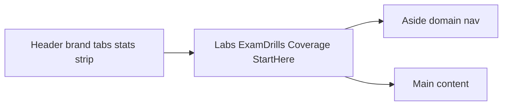

# Layout replica of the CCNA Lab Workbook artifact

## Source of truth (replaces screenshots)

User extracted the live artifact into:

`C:\Users\dbadmin\Downloads\CCNA Lab Workbook\`

| File | Role |
| --- | --- |
| `index.html` | Shell markup, full CSS (tokens, header, sidebar, labs, coverage, PBQ, setup/prose) |
| `app.js` | Tab renderers: `viewLabs`, `viewPbq` (Exam drills), `viewCoverage`, `viewSetup` (Start here) |
| `core.js` | Domains, objectives, Lab 0 — **CCNA curriculum; do not port content** |
| `labs-d*.js`, `pbq*.js` | CCNA labs/drills — **do not port content** |

**Verdict:** This extract is **better than screenshots** for Phase 1. It is the binding layout reference. Claude sign-in is no longer blocking.

**Clone:** chrome, CSS tokens, typography, widget hierarchy, four-tab shell.
**Do not clone:** CCNA objectives, Packet Tracer labs, PBQ item banks, Claude `db`/`user` sync, or PBQ interaction types that are not MC/MR.

**When built:** [`.cursor/plans/aws_terraform_workbook_92c3d04f.plan.md`](.cursor/plans/aws_terraform_workbook_92c3d04f.plan.md) **Phase 1** implements this file as the React shell.

## Design tokens (from `:root` in index.html)

Fonts: **Red Hat Display** (headings), **Red Hat Text** (body), **JetBrains Mono** (meta/code).

Light defaults (dark via `prefers-color-scheme` / `data-theme` — workbook follows `prefers-*` only, no theme toggle):

- Ground `#EDF0F4`, panel `#FFFFFF`, panel-2 `#F5F7FA`, ink `#141C26`, muted `#54626F`, faint `#8492A0`
- Rules `#D5DCE3` / strong `#BAC4CD`
- Accent `#0B63C4`, accent-soft `#DCE9F9`
- Domain colors `--d1`…`--d6` (map A0–A4 / T1–T4 to a similar numbered palette)
- Ok / warn / bad soft pairs for DONE WHEN, FIRST TIME, errors
- Code: bg `#0E1826`, ink `#D7E3F0`

Rainbow domain strip under header: six flex spans with domain weights (AWS app may use four AWS + four TF colors or keep a multi-segment strip).

## Shared shell (all tabs)

**Header `.top` (sticky):**

- Left `.brand`: `h1` title + `.code` version pill (`SAA-C03 + 004`)
- Center `.tabs` segmented control (`role="tablist"`): Labs | Exam drills | Coverage | Start here — selected = filled panel + shadow (`aria-selected`)
- Right `.overall`: sync label (“Saved in this browser”) · big `%` · mono step/lab counts
- Below: `.domstrip` 4px multi-color bar

**Layout `.shell`:** `300px` sticky sidebar + fluid main; collapses to single column ≤900px.

Hash views in source: `#labs` | `#pbq` | `#coverage` | `#setup`. Our React Router already uses `/labs` | `/exam` | `/coverage` | `/start` — keep those paths; map labels to the same four surfaces.

## Tab: Labs (`viewLabs` + lab cards)

**Sidebar (labs mode):**

- Top button: `All N labs · P%`
- Per domain: colored `N.0` pill, short name, `weight% · progress%`, thin meter
- Nested objective rows: id · short title · `done/total` labs; selected = inset accent bar

**Main:**

- Filters: search · difficulty select (Foundation / Practitioner / Advanced pips) · status select (Not started / In progress / Done) · `N shown`
- Amber/warn **First time here?** note linking to setup lab (GL-01 / A0)
- Per-objective section: large mono id + title + `N labs · P%` with thick colored underline
- **Lab card** (`
` pattern — React may use expand/collapse equivalently):
  - Summary row: id chip | title + kind · difficulty pips · time · `d/n` steps | status pill + SVG progress ring
  - Body: cost chip + topic chips · goal · BEFORE YOU START · STEPS (mono numbers + checkbox + optional code block with Copy) · green **Done when** note · optional Break it / Exam tip · footer actions
- Status pills: `ns` / `ip` / `dn` (Not started / In progress / Done)

**AWS mapping:** Stop charges + teardown PowerShell stay **inside** the card (workbook addition; not in CCNA source). Hourly cost-risk gate stays in-card.

## Tab: Exam drills (`viewPbq` — chrome only)

Source builds a **drill card grid** + detail article. Sidebar switches to “All drills” + domain meters with `done/total` drills.

**Main chrome to clone:**

- Eyebrow: short instruction line
- `.pbq-grid`: responsive cards (`minmax(260px,1fr)`)
  - Eyebrow: objective · kind label
  - Title
  - Meta: time · “Not tried” / “Best N%”
  - Selected card: accent border + inset ring
- Detail `.pbq` article: eyebrow · `h2` · prompt · interaction area · score row with primary **Check answers** / **Retry** and optional “Related lab” button

**Workbook adaptation (required):** CCNA PBQs use match / order / fill / calc / lines. Our app is **MC and MR only**. Keep the **card grid + detail article + Check/Retry chrome**; replace the interaction body with MC (one of four) / MR (select N of M) controls and post-submit rationale. Do not implement match/order/drag chrome.

Mock exam entry: a card or button in this tab (same visual language), not a fifth top-level tab.

## Tab: Coverage (`viewCoverage`)

**Main (sidebar can stay domain filter or hide meters — source keeps side with labs-style nav unused for coverage content):**

- Eyebrow explaining the matrix
- `.covsum` three big stats: topics with a lab · topics completed hands-on · labs-per-objective floor
- Per-objective `.cov-obj` panels:
  - `h3` with mono id + title
  - Table: topic name | lab id jump buttons (green when done) or red **No lab yet** gap

**AWS mapping:** rows = 189 SAA atomic IDs (and a Terraform section or second filter); status from registry (`missing`…`verified`); gap styling for uncovered bullets. Live vs design-exercise counts as additional summary chips if needed — same panel language.

## Tab: Start here (`viewSetup`)

**Main is prose-first (sidebar still rendered in source):**

- Eyebrow (exam line) · large `h2` hero line · intro paragraph
- `.facts` grid of key/value tiles
- Domain weight bar (`.weights`) + mono legend
- “How to use this workbook” numbered list
- Warn note (rules of engagement)
- Embedded setup lab card (Lab 0 → our A0 / GL-01)
- **Your progress** section: counts · `<textarea class="io">` export · Copy / Import / Reset buttons

**AWS mapping:** A0 lesson markdown + readiness “insufficient evidence” callout + export/import/reset (`RESET` confirm) + local-port / answer-key threat copy. Cost ledger entry can sit in this prose column without a fifth tab.

## Content mapping (layout only)

| Tab | Workbook surfaces |
| --- | --- |
| Labs | GL/UL cards, A0–A4 then T1–T4, cost/teardown in-card |
| Exam drills | MC/MR grid + runner + mock exam entry + readiness summary optional |
| Coverage | 189-row registry / topic matrix, discrepancy/gap affordances |
| Start here | A0, how-to, export/import/reset, threat copy, readiness insufficient-evidence |

Do not add `/dashboard`, `/cost`, `/settings`, `/mock-exam`, or `/exercises` as separate top nav.

## What not to port from the extract

- Any Cisco / Packet Tracer / CCNA objective text or lab steps
- Claude `claude.use("db"|"user")` cloud sync (local SQLite + “Saved in this browser” only)
- PBQ types other than MC/MR
- Embedding the Downloads folder into the repo as a dependency (reference only; re-implement in React + plain CSS)

## Phase 1 acceptance (layout)

- Four-tab shell matches tokens, header, strip, sidebar behavior, and tab bodies above
- Labs card includes Done when + Stop charges/teardown
- Exam drills uses MC/MR inside PBQ card chrome
- Coverage shows objective/topic matrix with gap styling
- Start here has setup + export/import/reset
- No fifth top-level tab
