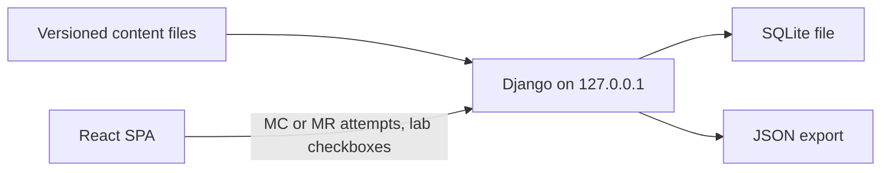

# AWS Solutions Architect + Terraform Lab Workbook

## What this is

Local **single-user** exam workbook for **SAA-C03** (189 atomic objective bullets from the supplied exam guide) and **Terraform Associate 004**.

- **UI:** React SPA at `http://127.0.0.1:5173` — four tabs: **Labs** | **Exam drills** | **Coverage** | **Start here**
- **API:** Django 6.1.1 JSON on `http://127.0.0.1:8000` (`backend/`)
- **Curriculum:** versioned JSON under `content/`
- **Progress:** SQLite at `backend/db.sqlite3` (gitignored)

You run AWS CLI and Terraform in **your own terminal**. The app never receives credentials or account IDs. **Agents never call AWS** and never run credentialed Terraform. Agent roles (Teacher is read-only; Lead Developer is the only writer) are in [`AGENTS.md`](AGENTS.md).

## What this is not

- Not a hosted product — no public deployment, login, or cloud database
- Not an AWS client — the app and agents do not call AWS APIs
- Not Docker/CI in this repo — no containers, Kubernetes, or GitHub Actions workflows
- Not exam pass prediction — readiness scores are coverage signals, not pass probability

## Features

| Area | What you get |
| --- | --- |
| **Labs** | 21 guided + 21 unguided lab pairs; cost tags, teardown, hourly cost-risk gate where required |
| **Exam drills** | MC/MR practice and exam modes; rationale after submit; mock exam (50 items, domain split 15/13/12/10) |
| **Coverage** | 189-row SAA registry; domain rollups; curriculum vs learner progress |
| **Start here** | A0 setup lesson; export/import `workbook-progress.json` (`schemaVersion: 1`); reset requires typing `RESET` |

Content floors (verified by `python scripts\content_lint.py`): ≥210 AWS MC/MR items, ≥111 Terraform items; 21+21 labs (≥15 steps / ≥15 criteria); 23 lesson files; registry in `content/coverage/saa_registry.json`. As of the last lint run: 429 questions (310 AWS / 119 TF), 21+21 labs, 23 lessons.

Deep link to a lab: `http://127.0.0.1:5173/labs?lab=<lab-id>` (for example `gl-01`).

## Architecture



- Vite has **no API proxy** — the browser calls Django directly (`fetch` with credentials for CSRF cookies).
- Answer keys live in `content/` and SQLite; the React bundle does not embed keys.
- No AWS, workers, or external services at runtime.

**Runtime model:** local only — `runserver` on `127.0.0.1:8000` and Vite on `127.0.0.1:5173`. Public hosting would need a new ADR (see [`docs/architecture.md`](docs/architecture.md)).

## Technology stack

| Layer | Versions / notes |
| --- | --- |
| **UI** | React ^18.3.1, react-router-dom ^7.9.1, Vite ^6.0.1, TypeScript ~5.6.2, plain CSS |
| **API** | Django 6.1.1 only ([`backend/requirements.txt`](backend/requirements.txt)) |
| **Database** | SQLite (`backend/db.sqlite3`) |
| **Spec targets** | Windows 11, Node 24 Active LTS, Python 3.13 latest micro ([`docs/product-requirements.md`](docs/product-requirements.md)) |
| **npm engines** | `node >=20` ([`frontend/package.json`](frontend/package.json)) |

Use Node 24 and Python 3.13 for a clean install per specs; `engines` is the minimum npm declares.

## Repository structure

```text
web_app/
├── frontend/          React + Vite SPA
├── backend/           Django JSON API + SQLite
├── content/           Lessons, questions, labs, exercises, citations, coverage
├── docs/              Product, architecture, labs, coverage, status
├── scripts/           content_lint and authoring gates
├── lab-fixtures/      Terraform sample for gl-20 (validate only, no apply)
├── reports/           Agent fix-loop notes (not end-user docs)
├── AGENTS.md          Teacher vs Lead Developer roles
├── start.ps1          Launch both servers on 127.0.0.1
└── README.md          This file
```

Real tests live in `backend/workbook/tests/` and `frontend/tests/e2e/`. The repo root `tests/` directory is empty (legacy layout in specs was never populated).

## Prerequisites

- **Windows 11** — lab commands are PowerShell-first ([`docs/labs-and-safety.md`](docs/labs-and-safety.md))
- **PowerShell 5.1+** — for [`start.ps1`](start.ps1)
- **Python 3.13** — create `backend/.venv` and install Django from `requirements.txt`
- **Node 24** (or at least `>=20` per `package.json` engines) and **npm**
- **Terraform CLI** — only if you run `terraform fmt`/`validate` on [`lab-fixtures/gl-20`](lab-fixtures/gl-20) or execute learner labs
- **AWS CLI v2** — only for **your** live labs, not required to run the app

MCP servers (AWS Knowledge, Terraform registry/docs) are for **authoring** content, not for running the app.

## Quick start

### First-time backend setup

```powershell
cd backend
python -m venv .venv
.\.venv\Scripts\Activate.ps1
pip install -r requirements.txt
python manage.py migrate
```

### Option A — one command (after backend setup)

From the repo root:

```powershell
.\start.ps1
```

Starts Django on `http://127.0.0.1:8000` and Vite on `http://127.0.0.1:5173`, opens the browser, and runs `npm install` in `frontend` if `node_modules` is missing. Close the two console windows to stop the servers.

### Option B — two terminals

**Backend:**

```powershell
cd backend
.\.venv\Scripts\Activate.ps1
python manage.py runserver 127.0.0.1:8000
```

**Frontend:**

```powershell
cd frontend
npm ci
npm run dev -- --host 127.0.0.1 --port 5173
```

(`npm install` works if you prefer; [`docs/product-requirements.md`](docs/product-requirements.md) cites `npm ci` for clean install.)

Open **http://127.0.0.1:5173** — you should see the four tabs. Optional API check: `GET http://127.0.0.1:8000/api/health` → `{"status":"ok"}`.

## Configuration

| Setting | Purpose |
| --- | --- |
| **`VITE_API_BASE`** | Optional. API origin for the SPA. Default: `http://127.0.0.1:8000`. Set in `frontend/.env` (gitignored). Example: `VITE_API_BASE=http://127.0.0.1:8000` |

There is no `.env.example` in the repo. Django settings (`SECRET_KEY`, `DEBUG`, CORS, SQLite path) are **hardcoded** for local use in [`backend/config/settings.py`](backend/config/settings.py) — do not expose this stack to the internet.

**CORS / CSRF:** browser origins on Vite ports **5173** and **5174** (`127.0.0.1` and `localhost`) are allowed. POST requests need Django CSRF: call `GET /api/health` first, then send `X-CSRFToken` from the `csrftoken` cookie. Details: [`backend/README.md`](backend/README.md).

## Using the app

| Route | Tab |
| --- | --- |
| `/labs` | Labs (default; `/` redirects here) |
| `/exam` | Exam drills |
| `/coverage` | Coverage |
| `/start` | Start here (A0, export/import/reset, local-threat copy) |

## API (short reference)

- **Base URL:** `http://127.0.0.1:8000`
- **Auth:** none (local trust model)
- **CSRF:** required on POST (see Configuration)

| Method | Path | Purpose |
| --- | --- | --- |
| GET | `/api/health` | Health; sets CSRF cookie |
| GET | `/api/content/summary` | Content IDs and indexes |
| GET | `/api/content/catalog` | Question list (no answers) |
| GET | `/api/lessons/<id>` | Lesson JSON |
| GET | `/api/questions/<id>` | Question without keys/rationale |
| POST | `/api/attempts` | Submit and score attempt |
| GET | `/api/labs/<id>` | Lab JSON (`?reveal=1` includes solution) |
| POST | `/api/labs/<id>/checkpoints` | Lab checkpoint status |
| GET | `/api/progress` | Progress snapshot |
| POST | `/api/export` | Export progress JSON |
| POST | `/api/import` | Import progress (max 2 MiB, `schemaVersion: 1`) |
| POST | `/api/reset` | Clear progress if body `{"confirm":"RESET"}` |
| GET | `/api/metrics/readiness` | Readiness metrics |
| GET | `/api/coverage` | SAA coverage registry |

Full route list: [`backend/workbook/urls.py`](backend/workbook/urls.py).

## Content and labs

- Curriculum lives in git under `content/`; the app reads it at runtime via `CONTENT_ROOT`.
- **Learner** runs create/teardown in a terminal; **agents** never apply or destroy cloud resources.
- **Lab fixture:** [`lab-fixtures/gl-20`](lab-fixtures/gl-20) — fmt/validate only (no credentials, no apply).

Catalog, cost rules, and hourly lab IDs: [`docs/labs-and-safety.md`](docs/labs-and-safety.md). Readiness formula: [`docs/coverage-and-metrics.md`](docs/coverage-and-metrics.md) — note that early Phase 0 “all missing” tables in that file are **historical**; current registry status is described in [`docs/delivery-report.md`](docs/delivery-report.md) and [`docs/citation-recheck.md`](docs/citation-recheck.md) (sample MCP re-check done; full drill bank largely `pending_recheck`).

## Safety

- **$10 is a warning, not a stop**
- **Teardown on every lab** — stopping an instance is not teardown
- **Hourly labs** require typing `I ACCEPT THE COST RISK` before create/apply (see lab catalog in [`docs/labs-and-safety.md`](docs/labs-and-safety.md))
- **HCP Terraform** hands-on only on a no-charge plan
- Default region for labs: **us-east-1**; required tags documented in product/labs specs
- **Free Tier is never assumed**

## Development

- **Roles and plans:** [`AGENTS.md`](AGENTS.md) — Teacher (read-only on content correctness); Lead Developer (only writer; plan-first; definition of done).
- **KISS:** if a feature does not teach an exam bullet, protect you from a surprise bill, or score/store progress, it is not built.

**Common commands:**

```powershell
# Backend
cd backend
.\.venv\Scripts\Activate.ps1
python manage.py migrate
python manage.py runserver 127.0.0.1:8000

# Frontend
cd frontend
npm run dev
npm run build
npm run lint
npm run preview

# Content gate (repo root)
python scripts\content_lint.py
```

Authoring helpers live under `scripts/` (for example `scan_lab_placeholders.py` when lab JSON changes). Content rewrite ops for agents: [`HANDOFF.md`](HANDOFF.md) — not required for app development.

## Testing and checks

Lead Developer definition of done ([`AGENTS.md`](AGENTS.md)):

```powershell
cd backend
.\.venv\Scripts\Activate.ps1
python manage.py test workbook

cd ..
python scripts\content_lint.py

cd frontend
npm run build
```

**Optional:**

```powershell
cd frontend
npm run lint
npm run test:e2e
```

Playwright starts or reuses Django on `127.0.0.1:8000` and Vite on `127.0.0.1:5173`; it expects `backend\.venv\Scripts\python.exe` (Windows). No Vitest/Jest unit tests on the frontend.

**When `lab-fixtures/**` changes:**

```powershell
cd lab-fixtures\gl-20
terraform fmt -check
terraform init -backend=false
terraform validate
```

**When lab JSON changes:** `python scripts\scan_lab_placeholders.py` from repo root.

## Troubleshooting

| Symptom | What to check |
| --- | --- |
| `start.ps1` — backend venv missing | Create venv, `pip install -r requirements.txt`, `python manage.py migrate` (message in script) |
| `start.ps1` — npm not found | Install Node.js; run `npm install` in `frontend` |
| POST fails with 403 / CSRF | Use UI origin `http://127.0.0.1:5173` (or 5174); ensure `GET /api/health` ran so CSRF cookie exists; send `X-CSRFToken` on POST |
| “Origin not allowed” | Origin must match CORS allowlist in [`backend/config/settings.py`](backend/config/settings.py) |
| UI loads but drills/labs won’t save | Django not running on `127.0.0.1:8000`; check `VITE_API_BASE` if you changed it |
| Stop servers after `start.ps1` | Close the two server console windows |
| Import fails | Export must be `schemaVersion: 1`; corrupt import leaves DB unchanged |
| Reset | POST `/api/reset` with `{"confirm":"RESET"}` from Start here |

Historical CSRF fix context: [`docs/change-requests.md`](docs/change-requests.md) (CR-0006).

## Agent and contribution workflow

This is a personal workbook with agent roles, not a generic open-source CONTRIBUTING flow.

1. Teacher drafts a change request in chat.
2. Lead Developer records it in [`docs/change-requests.md`](docs/change-requests.md).
3. Lead Developer writes a plan; you approve before implementation.
4. Content-affecting changes need Teacher validation before and after implementation.

**License:** no `LICENSE` file is present in the repository. Treat redistribution as **needs verification** with the owner.

Never hand-edit `backend/db.sqlite3`.

## Known limitations

- Drill stems are largely objective-aligned templates; full bank remains **`pending_recheck`** for exam-quality polish ([`docs/citation-recheck.md`](docs/citation-recheck.md)).
- Coverage registry rows are **`implemented_unverified`** until human/MCP review — not the same as “verified on the exam.”
- Playwright smoke covers tabs and GL-01 chrome, not full lab walkthroughs ([`docs/delivery-report.md`](docs/delivery-report.md)).
- Django uses **DEBUG** and a local insecure **SECRET_KEY** — local use only.
- Cross-platform support is not documented; `start.ps1` and Playwright paths are **Windows-oriented**. Django/npm may work elsewhere but are not guaranteed.

## Further documentation

| Document | Topic |
| --- | --- |
| [`docs/architecture.md`](docs/architecture.md) | Topology, tabs, scoring, threat model |
| [`docs/product-requirements.md`](docs/product-requirements.md) | REQ ids, scope, out of scope |
| [`docs/labs-and-safety.md`](docs/labs-and-safety.md) | Lab catalog, cost, teardown |
| [`docs/coverage-and-metrics.md`](docs/coverage-and-metrics.md) | Readiness formula (ignore stale Phase 0 missing tables) |
| [`docs/citation-recheck.md`](docs/citation-recheck.md) | MCP sample re-check evidence |
| [`docs/status.md`](docs/status.md) | Implementation ledger |
| [`docs/delivery-report.md`](docs/delivery-report.md) | Phase 6 sign-off snapshot |
| [`AGENTS.md`](AGENTS.md) | Agent roles and checks |
| [`backend/README.md`](backend/README.md) | API bind, CORS, CSRF |
