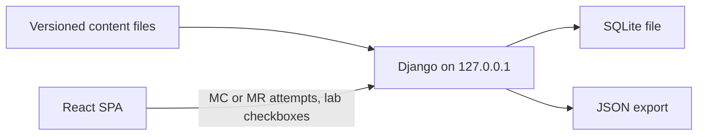

# Architecture

Workbook architecture specification. Spec version 1. Implements REQ-P01, REQ-P40–P53, REQ-P60–P61. Approved plan baseline 2026-09-23.

## Layout requirement (Phase 1)

REQ-A01. **Phase 1 implements** the layout replica in [`.cursor/plans/ccna_layout_replica_160c046c.plan.md`](../.cursor/plans/ccna_layout_replica_160c046c.plan.md). Four tabs only: **Labs** | **Exam drills** | **Coverage** | **Start here**. Header stats, sidebar, lab-card chrome, in-card cost-risk and Stop charges match that plan. Phase 0 does **not** build UI chrome. Later phases fill those four tabs; they do not invent a different shell.

REQ-A02. Recapture Exam drills, Coverage, and Start here screens from the Claude artifact **before Phase 1 coding** if still unsigned; patch the layout plan first.

REQ-A03. Product copy is AWS + Terraform; widget types, placement, and hierarchy stay identical to the CCNA artifact replica.

## Runtime topology

REQ-A10. Local React SPA. Django JSON views on `127.0.0.1` only. Reject non-local origin.

REQ-A11. Progress stored in `backend/db.sqlite3` (gitignored). Content lives in git under `content/`.

REQ-A12. No AWS calls from the app. No credentials or account IDs accepted by any API.

## Stack pins

REQ-A20. UI: TypeScript, Node 24 Active LTS, React, React Router, Vite, plain CSS, npm, lockfile committed.

REQ-A21. API: Django 6.1.1 JSON views. No third-party REST framework without a new ADR. Python 3.13 latest micro on scaffold day. `backend/requirements.txt` pinned.

REQ-A22. Tests: Django test runner for scoring; Playwright for the vertical slice; content lint; `terraform fmt -check` and `terraform validate` without credentials.

## Repository layout

REQ-A30. Required trees (created when their phase begins; Phase 0 creates only `docs/` specs):

- `docs/` — five specs (this file and siblings)
- `content/objectives|lessons|questions|labs|exercises|citations|coverage`
- `frontend/src`
- `backend/`
- `lab-fixtures/` with gitignored state
- `tests/unit`
- `tests/e2e`

## Tab surface map

Functional surfaces render **inside** the four tabs (REQ-P40/P41, REQ-A01):

| Tab | Surfaces |
| --- | --- |
| Labs | Guided/unguided lab cards, steps, DONE WHEN, BEFORE YOU START, cost tags, Stop charges, cost-risk gate, teardown without opening gated solution |
| Exam drills | MC/MR practice and exam modes, rationale after submit, mock exam entry, readiness panels (insufficient evidence until thresholds) |
| Coverage | 189-row registry view, domain/task rollups, discrepancy notes, planned vs verified, service awareness |
| Start here | Setup/A0 lesson entry, settings (export/import/reset), local-threat copy, cost ledger entry point |

REQ-A40. Do not ship standalone routes that replace the four-tab shell (`/curriculum`, `/history`, `/sources` as separate apps are dropped).

## Scoring and persistence API (conceptual)

REQ-A50. Attempt record: `question id`, mode (`practice` \| `exam`), presented order, selected ids, correct, assisted, submitted time. No confidence slider, no content hash, no idle timer.

REQ-A51. Lab evidence: checkpoint checkboxes; status `not-started` \| `self-reported` \| `unresolved`. Never labeled “verified in AWS.”

REQ-A52. Cost entry: manual ledger, not live billing.

REQ-A53. Export file name `workbook-progress.json`, `schemaVersion: 1`. Import: validate schema, reject unknown future versions, replace or abort; corrupt file leaves DB unchanged. Reset requires typing `RESET`.

REQ-A54. Answer keys exist in content files and SQLite; React bundle must not embed keys. Settings copy on Start here states the local-port and key-visibility risks.

## Accessibility and threat model

REQ-A60. Visible focus, skip link, labeled controls, WCAG 2.2 AA, keyboard path, no information by color alone, viewports 375px and 1280px, copy button plus `<pre>` for command blocks.

REQ-A61. Markdown without raw HTML; size-capped schema-checked imports; `rel="noopener noreferrer"`; no CLI output uploaded; CSRF on; lockfiles committed; Terraform state and `db.sqlite3` never in git.

REQ-A62. Public hosting requires a new ADR (out of scope).

## Phase 1 vertical slice acceptance (architecture view)

Done when section 3 of the workbook plan’s end-to-end path works **inside the replica shell**:

1. Clean Node 24 and Python install.
2. Django on `127.0.0.1` + SQLite.
3. One A0 lesson on Start here.
4. One MC and one MR on Exam drills with rationale and persistence across reload.
5. GL-01 on Labs with cost/teardown in-card.
6. Insufficient-evidence readiness copy.
7. Export/import on Start here.
8. `npm run build` succeeds.

## Out of scope for this spec

- Implementing React/Django code in Phase 0
- Agents calling AWS or credentialed Terraform
- Adding MCP servers into the web app runtime
